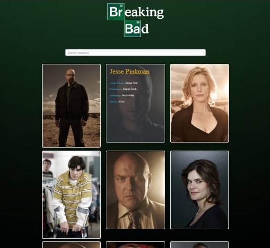

# Breaking Bad Cast React App

*Just a simple React App which displays the info of the actors casted in this tv series*

Live Link : [Click Here](https://breaking-bad-cast-info.netlify.app/)

- made using `create-react-app`
- for styling, `Bootstrap CSS` is used
- different folders have been organised for `UI compnents` & `character components`
- the `Search component` is the most cool one, which fires off an event as soon as there is a change in the text input field and shows the desired output
- for fetching the data, `axios` is used

